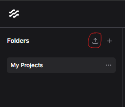

## Use langflow

## Prerequisites for this project

- install Ollama from [https://ollama.com](https://ollama.com/download)
- start ollama
  - `ollama serve`
  - ollama will run on localhost:11434
- pull models
  - `ollama pull llama3.2:3b`
  - `ollama pull all-minilm:22m`

### installation

- install Python from [https://www.python.org](https://www.python.org/downloads/) if necessary
  - version 3.12.7 used in this project (for langflow installation python 3.10 or 3.12 is required)
- create a virtual environment
  - `python -m venv langflow_env`
- activate virtual environment
  - `.\langflow_env\Scripts\activate`
- navigate to `.\03_chat_with_widget` and install requirements
  - `pip install -r requirements.txt`

### run langflow UI

- activate virtual environment
  - `.\langflow_env\Scripts\activate`
- run `python -m langflow run`
- go to `localhost:7860`

### add flows

- on the top left click `Add Flow` and add a new flow
  
- select all json files in `.\03_chat_with_widget\FlowIDs` and click `open`
- open the flows and adapt filepaths in Faiss and Directory cards

### run langflow in background

- to specify a port and run in background: `python -m langflow run --port 7888 --backend-only`

### start chatbot

- open `.\03_chat_with_widget\index.html` in a browser and start chatting
  - the script includes the logic for the UI
  - the flow_id defines the flow to use