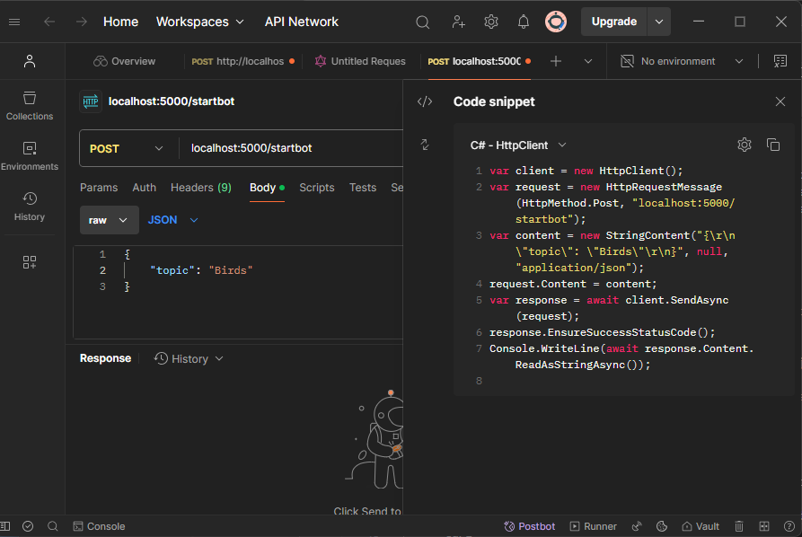

# Offline Chatbot

## Introduction

With this chatbot it is possibe to use different vector stores depending on the page of the sample app.
A button in the sample app triggers the chatbot and passes the page/vector store name via a flask API call.
The chatbot retrieves content form flask API based on user input.
The content then is part of the prompt and is executed using OllamaSharp.

Ollama and FlaskAPI have to be running to use the chatbot.

## Prerequisites

- install Ollama from [https://ollama.com](https://ollama.com/download)
- start ollama
  - `ollama serve`
  - ollama will run on localhost:11434
- pull model
  - `ollama pull llama3.2:3b`
- install Python from [https://www.python.org](https://www.python.org/downloads/) if necessary
  - version 3.12.7 used in this project
- create a virtual environment
  - `python -m venv chatbot_env`
- activate virtual environment
  - `.\chatbot_env\Scripts\activate`
- navigate to `.\Final_Project\FlaskAPI` and install requirements
  - `pip install -r requirements.txt`

### download embedding model

- acitvate virtual environment
  - `.\chatbot_env\Scripts\activate`
- navigate to `.\Final_Project
- run `python download_model.py`

### create vector store (optional)

Example vector stores (Dogs and Birds) for demonstration purpose are provided in this project.
To adapt for other projects the paths in python scripts have to be adapted.
The value passed from the sample app when starting the chatbot has to be the name of the vector store.

- create a virtual environment
  - `python -m venv indexing_env`
- activate virtual environment
  - `.\indexing_env\Scripts\activate`
- navigate to `.\Final_Project\CreateVS` and install requirements
  - `pip install -r requirements.txt`  
- add folder with information to be indexed to `.\Final_Project\InfoSource`
  - must be same name as value passed from sample app
- update topic in indexing.py in `.\Final_Project\CreateVS`
  - `topic = "Birds"`
  - replace "Birds" with value you want to use
- create vector store
  - run `python indexing.py`
- to start the chatbot from your app you need to implement a http post request passing the chosen name as parameter topic
  - tipp: use Postman to try and get code snippets if needed
  

## Usage

- activate chatbot_env
  - navigate to chatbot_env
  - `.\Scripts\activate`
- navigate to `.\Final_Project\FlaskAPI`
- run `python app.py`
- open new terminal and start Ollama with `ollama serve`
- start sample app
- click on button on Dog or Bird page to start chatbot

# Acknowledgements

## all-mpnet-base-v2

This project utilizes the [`all-mpnet-base-v2`](https://huggingface.co/sentence-transformers/all-mpnet-base-v2) model provided by [Sentence Transformers](https://www.sbert.net/).

The model is licensed under the [Apache License 2.0](./LICENSE.txt).

## Llama 3.2

This project utilizes the [LLaMA 3.2](https://example.com/llama-3.2) model developed by [Meta AI](https://ai.meta.com/).

The model is used under the [LLaMA 3.2 License Agreement](./LICENSE.txt).

## hnswlib

This project utilizes the [hnswlib](https://github.com/nmslib/hnswlib) library, which is released under the [Apache License 2.0](./LICENSE.txt).

## Flask

This project utilizes the [Flask](https://flask.palletsprojects.com/) framework, which is released under the [BSD 3-Clause License](./LICENSE.txt).

## sentence transformers

This project utilizes the [sentence transformers](https://www.sbert.net/) library, which is released under the [Apache License 2.0](./LICENSE.txt).